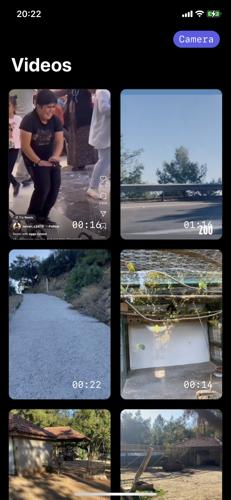
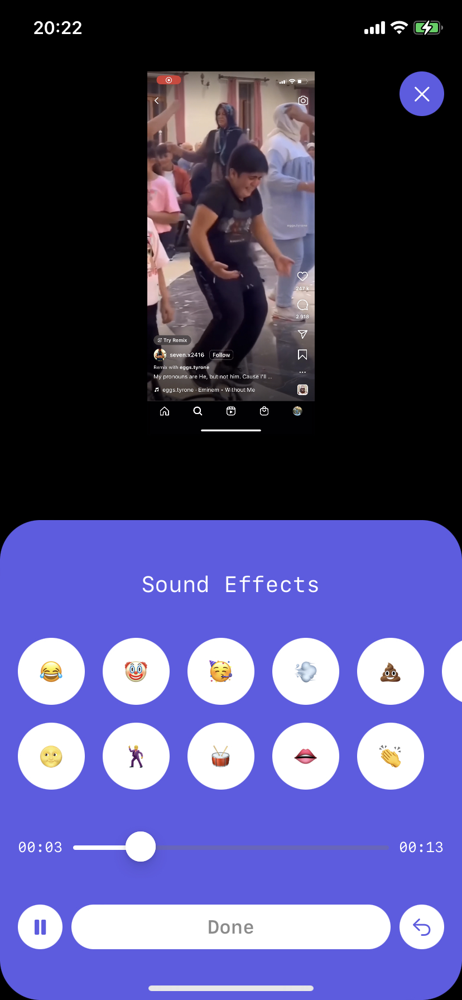

# VSE - Video Sound Effects

	
	

## Features

- Pure SwiftUI
- Custom camera & audio player screen
- Apply multiply audio to a video using AVKit and export it
- No third party libraries

## Requirements

- iOS 16+
- Swift 5.7

## History and Plans

- [x] Create and upload to AppStore `In testflight`
- [ ] Select architecture
- [ ] Handling errors & unexpected behaviour
- [ ] Add more sounds
- [ ] Create original app icon
- [ ] Create onboarding screen
- [ ] Integrate fastlane / firebase
- [ ] Add analytics
- [ ] Add unit tests
- [ ] Add voice effect

## Links

- [AppStore](https://itunes.apple.com/app/id1533690813)
- [Site](https://alobanov11.ru/)