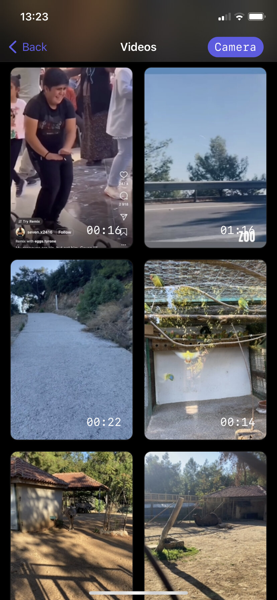
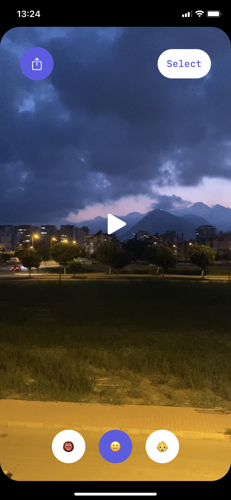

# VSE - Video Sound Effects

Video Sound Effects - the app which allows you to apply sound filter to a video from your library or camera.

	
	

## Features

- Pure SwiftUI
- No third party libraries
- Custom camera & player screen
- Apply multiply filters to a video

## Requirements

- iOS 16+
- Swift 5.7

## History and Plans

- [x] Create and upload to AppStore `In testflight`
- [ ] Divide logic into separate objects
- [ ] Select architecture
- [ ] Handling errors & unexpected behaviour
- [ ] Add more effects
- [ ] Create original app icon
- [ ] Create onboarding screen
- [ ] Integrate fastlane / firebase
- [ ] Add analytics
- [ ] Add unit tests

## Links

- [AppStore](https://itunes.apple.com/app/id1533690813)
- [Site](https://alobanov11.ru/)